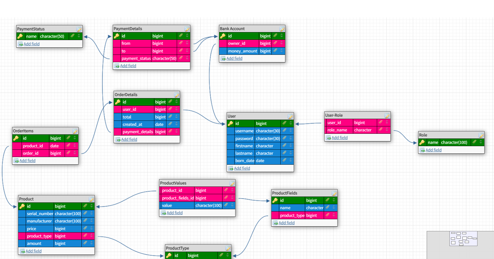

# HardwareStore

### Техническое задание:
#### 1) Описание проекта
    
Проект представляет собой веб-сервис магазина техники, 
который будет предоставлять удобный интерфейс пользователям по приобретению товаров онлайн.

#### 2) Описание функциональности

   Основные роли пользователей: Покупатели, Модераторы и Администраторы

* Функциональность для покупателей:
  * Регистрация и аутентификация пользователей
  * Просмотр списка товаров
  * Добавление товаров в корзину
  * Оформление заказа
  * Отслеживание статуса заказа

* Функциональность для модераторов:
  * Просмотр заказов пользвателей
  * Обработка заказов и изменение их статусов

* Функциональность для администраторов:
  * Добавление новых товаров в базу данных
  * Изменение данных товаров в базе данных
  * Просмотр списка заказов и их статусов

#### 3) Нефункциональные требования:
* Требования к архитектуре
  * Приложение должно быть построено по принципу MVC.
  * Клиент-серверная архитектура должна быть реализована в стиле RESTful API
  * Должна быть реализована стандартная структура проекта Spring Boot (модели, контроллеры, репозитории и т.д.).

* Требования к безопасности
  * Для аутентификации и авторизации пользователей должен быть использован Spring Security.
  * Для этого должна быть применена технология JWT.
  * Пароли пользователей должны храниться в базе данных в зашифрованном виде.

#### 4) Технические требования:
   * Основной стек технологий:
   * Бэкенд-часть: Spring boot
   * Фронтенд часть: Thymeleaf
   * СУБД: PostgreSQL
   * Безопасность: Spring Security

### База Данных:
Примерная схема базы данных выглядит следующим образом:

